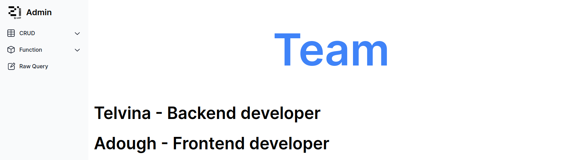
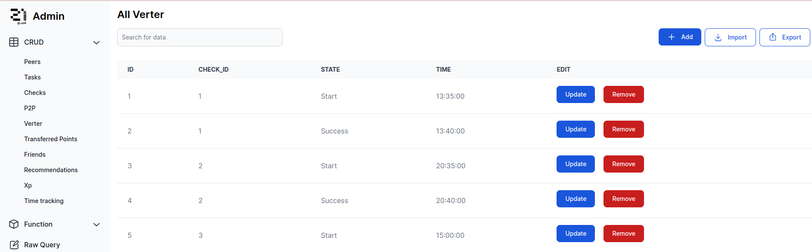
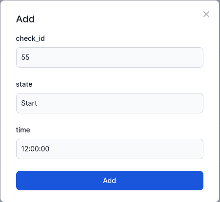
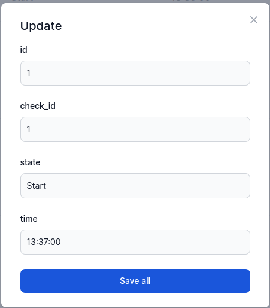
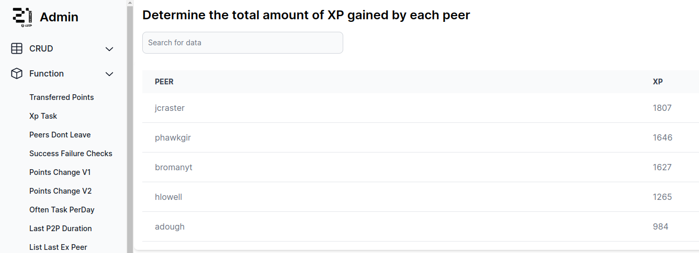
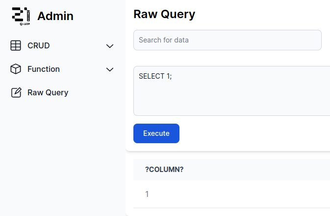

#StudentsInfo

Fullstack project for working with a database that stores information about students

## Content

This project is a full-fledged web application that allows you to work
with a database of information about students.

In essence, the project is a logical continuation of the project,
associated with the development of a database for storing information about students.
[Database](https://github.com/sav1nbrave4code/StudentsInfoDB)

Implemented:
1. CRUD for all tables in the database
2. Calling functions and procedures in the database
3. Import and export tables to csv files
4. Execution of a query to the database
5. Convenient web interface
6. Proxy service
7. Logging

What was used:
1. Frontend - `JS + React`
2. Backend - `Golang + Chi`
3. Database - `PostgreSQL`
4. Proxy - `Nginx`
   
All components of the project - run in separate docker containers and
combined into one layer using docker-compose. Accordingly, to run this application
`docker` and `docker-compose` are required.

The application uses the following ports:
1. 4500 - proxy (main)
2. 3000 - front end
3. 8080 - backend
4. 5432 - database

To run the `make` application to clear the cache of docker containers `make clean`.

Some examples of what the application looks like:

Table

Adding an entity to a table

Changing an entity in a table

Removing an entity from a table

The result of the function

Query result

