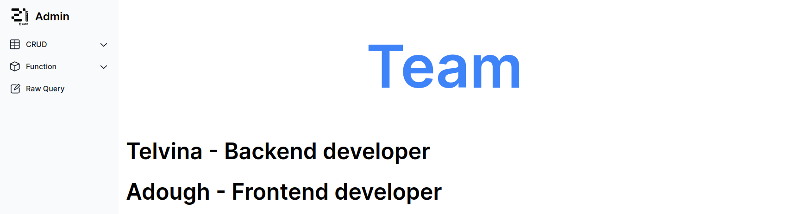
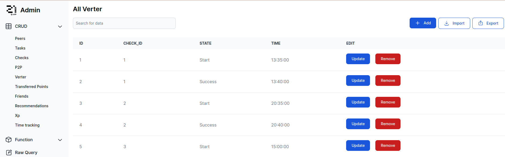
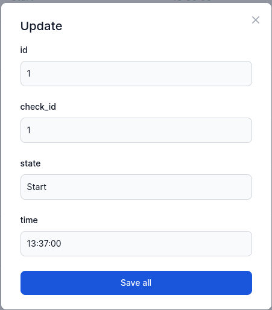
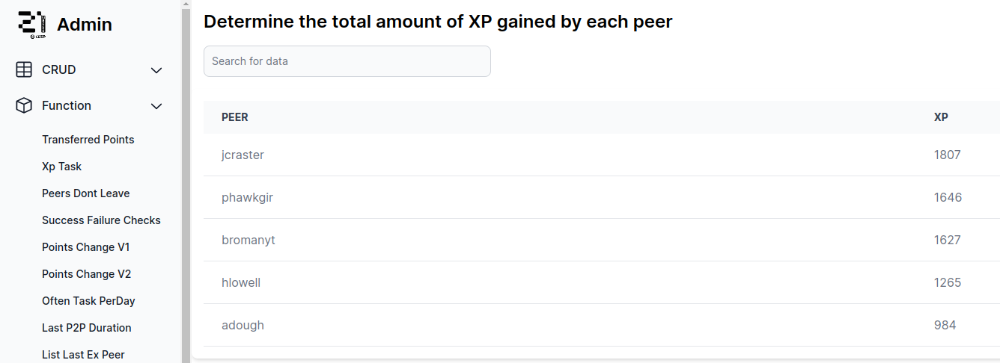
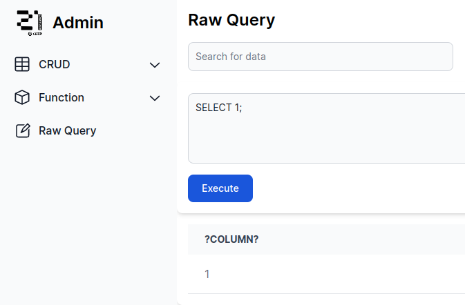

# StudentsInfo

Фул-стек проект для работы с базой данных, хранящей информацию о студентах 

## Содержание

Данный проект является полноценным веб приложением, позволяющим работать
с базой информации о студентах.

По сути проект представляет собой логическое продолжение проекта,
связанного с разработкой базы данных для хранения информации о студентах.
[База данных](https://github.com/sav1nbrave4code/StudentsInfoDB)

Реализованы:
1. CRUD для всех таблиц в базе данных
2. Вызов функций и процедур в базе данных
3. Импорт и экспорт таблиц в csv файлы
4. Исполнение запроса к базе данных
5. Удобный веб-интерфейс
6. Проксирующий сервис
7. Логирование

Что использовалось:
1. Frontend - `JS + React` 
2. Backend - `Golang + Chi`
3. Database - `PostgreSQL`
4. Proxy - `Nginx` 

Все составляющие проекта - запускаются в отдельных docker контейнерах и
объеденины в один слой с помощью docker-compose. Соответственно для запуска данного приложения
требуются `docker` и `docker-compose`.

Приложение использует следующие порты:
1. 4500 - proxy (основной)
2. 3000 - frontend
3. 8080 - backend
4. 5432 - database

Чтобы запустить приложение `make`, чтобы очистить кэш докер контейнеров `make clean`.

Некоторые примеры того, как выглядит приложение:

Таблица

Добавление сущности в таблицу

Изменение сущности в таблице

Удаление сущности из таблицы

Результат работы функции

Результат выполнения запроса

